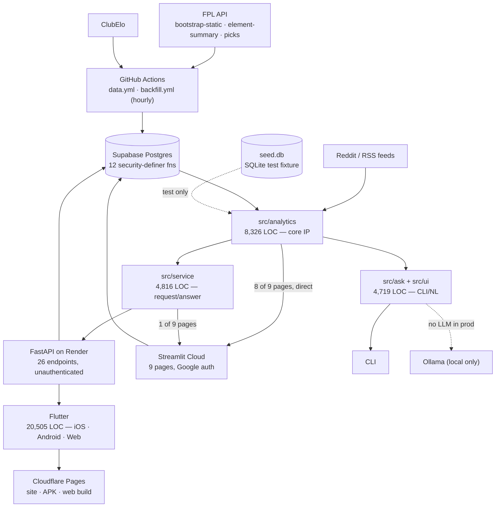

# MadBoots — Product, Architecture, Security & Technical Debt Review

**Date:** 2026-10-01
**Status:** Evidence and options. **No decisions taken, no code changed.**
**Asked for:** a structured step back from individual implementation issues — see the brief agreed with the
product owner, 2026-10-01.

⭐ **Every number below came from running something against this repository.** The commands are kept so any
claim can be re-run rather than believed. Where a fact depends on live infrastructure I could not read
(deployed secrets, the live database, hosting bills), it is marked **unverified** rather than estimated.

---

## 1. Executive summary

**The project is in better structural health than the volume of open questions suggests.** The things that
are usually wrong at this stage are not wrong here: no credential has ever been committed, every direct
dependency is pinned, the API runs non-root with rate limits, and the Streamlit app — the component whose
future is most in doubt — turns out to be a **leaf**, imported by nothing.

Four findings matter enough to name up front.

**1. Retiring Streamlit is a delete, not an untangle.** Nothing outside `src/web_streamlit/` imports it.
Ten files elsewhere mention it; all ten are prose in comments. The project has been quietly extracting
shared logic *out* of Streamlit for months (ADR-251, `kits.py`, `relay.py`, `compare.py`, `api/media.py`),
and that work is essentially done. **This is the single most reversible-looking decision on the list, and
the measurement says it genuinely is.**

**1b. And the usage data, run on 2026-10-01, says Streamlit's consumer role has already ended.** My Squad
fell 79.1 → 4.2 events per active day across the phone launch and Players went to zero, while every
lightly-used page held steady. Total engagement rose ~60%, because the app found usage the web was not
getting. ⭐ What remains is an admin console: 35% of surviving Streamlit traffic is the owner's own page
(§3). ⚠️ Eight pages that look abandoned were **deleted**, not abandoned — a reading that would have
condemned the optimiser on evidence that never existed.

**2. But the two UIs are not the same product, and the gap is wider than the status file implies.**
`PROJECT_STATUS` says *"Streamlit imports `src/service` in-process (ADR-219)"*. That is true of **one page
out of nine**. The other eight call `src/analytics` directly. So Streamlit and Flutter are not two faces on
one service — they are **two orchestration layers over one analytics core**. That changes what retiring
Streamlit costs: the analytics survive, the assembly logic for eight pages does not.

**3. One new security finding, low severity, not in the September review:** the rate limiter's hit table
grows without bound and is keyed on a client-controlled header. 🟡 Memory, not data.

**4. The dependency scan — the gap the September review explicitly left open — is now closed.** Three CVEs
exist in `urllib3 2.7.0` in the local tree. **All three are unreachable in this codebase** (verified: no
streaming, no proxies anywhere). The structural point is larger than the finding: direct dependencies are
pinned meticulously; **transitive ones are not pinned at all**, so what actually ships is decided by the
clock at image-build time.

**A fifth, found after the first draft and worth its own line:** `requirements.txt` states that Google auth
is **off** on the deploy and says it was *"proved rather than assumed"*. It is **on** — the owner confirmed
it. What was proved concerned the local machine; what was claimed concerned production (§4). ⭐ *The same
file made the same class of error four days earlier (ADR-322), which makes it a pattern rather than a slip.*

**On the question that started this:** cross-device sync is absent from Flutter by design, documented in
ADR-259, and the owner's own cross-device testing is explicitly *not* the trigger that ADR names. Nothing
here argues for building it now.

---

## 2. Current architecture



### Component inventory

| Component | Size | Class | Note |
|---|---|---|---|
| `src/analytics` | 8,326 LOC | 🟢 **Core IP** | xP, optimiser, price, DNA, transfer. Reused by every surface. |
| `src/service` | 4,816 LOC | 🟢 **Core IP** | The request/answer contract. Flutter's only path in. |
| `src/ask` + `src/ui` | 4,719 LOC | 🟢 **Core IP** | NL routing + renderers; the CLI's engine. |
| `src/api` | 474 LOC | 🟠 Infrastructure | FPL/ClubElo/Reddit clients, retry. |
| `src/web_streamlit` | 10,571 LOC | 🔵 **Client/UI** | A leaf. Nothing imports it. |
| `mobile/lib` | 20,505 LOC | 🔵 **Client/UI** | Flutter, three platforms from one codebase. |
| `src/web` | 104 LOC | ⚪ **Redundant** | ADR-050's "frozen" HTML edge. Local-only, undeployed, still tested. |
| `spikes/` | 3,974 LOC, 22 dirs | ⚪ **Experimental** | Committed research. Excluded from the API image. |
| `sql/` | 14 files | 🟠 Infrastructure | `setup.sql` is the live one; 13 others are history/ops. |

---

## 3. Streamlit assessment

### What the measurement says

| | |
|---|---|
| Streamlit source | **10,571 LOC** — 31% of `src/` |
| Test file named for it | `tests/test_web_streamlit.py` — **4,807 LOC, 254 tests** |
| Test files touching it at all | **55 files, 15,938 LOC, 1,048 tests** — 34% of the 3,072-test suite |
| Imported by anything outside itself | **No.** Zero imports. Ten prose mentions in comments. |
| Pages | 9 (My Squad · FDR · Signals · Team DNA · Players · Trending · Help · Feedback · Admin) |
| Path into the engine | **8 of 9 pages → `src.analytics` directly.** Only `views/squads.py` uses `src.service`. |

```bash
git grep -lE "web_streamlit" -- "src/" ":!src/web_streamlit"   # 10 files, all comments
grep -rn "src\.service" src/web_streamlit/                      # 1 view
```

### What exists only in Streamlit

**Google sign-in and the entire identity system.** `auth.py` → `user_key(email)` → the Supabase squads,
prefs and watchlist tables. ⭐⭐ **This is the asset.** The Flutter app has no identity at all, so Streamlit
is currently the only place in MadBoots where a person — as opposed to a public manager id — exists.

**Also Streamlit-only:** the Admin page (usage/roster), the beta registration and waitlist gate, saved-squad
backup/restore as files, and Squad Lab.

### What would actually be lost

Not analytics. Every engine module is shared or reachable. What would be lost is **the only working account
system**, the **admin/observability surface**, and the **beta gate** — and about 1,000 tests whose subject
no longer exists.

### What would be required to replace it

Accounts, admin and the gate would have to be rebuilt on the Flutter/API side — which is ADR-259's Stage C,
the most expensive item on the whole list. ⚠️ **So "retire Streamlit" and "build accounts" are the same
project**, and doing the first without the second deletes a capability rather than moving it.

### The public-repo constraint

The repo is public because Streamlit Community Cloud's free tier requires it. That constraint is **real but
currently benign** — verified: nothing sensitive has ever been committed, and the public repo is itself a
control (two tests exist *because* it is public, and both have fired for real).

⭐ It becomes a problem only in the commercial scenario. **Retiring Streamlit is what unlocks going private**
— which means the repo question is downstream of the Streamlit question, which is downstream of the money
question.

### ✅ What the usage data says (added 2026-10-01, after query 7 was run)

⭐⭐ **The question this section could not answer when it was written now has an answer.** Query 7 compares
each page either side of the phone app's launch (2026-09-24), per *active day* rather than by totals.

🔴 **First, the trap — because reading this table naively produces a badly wrong conclusion.** Eight pages
show zero use after the app: Squads · News · Leagues · Maddie Explains · Squad Lab · Ask · Fixtures · Ask
Maddie. ⚠️⚠️ **All eight were deleted from the repository**, each within days of its last recorded use
(`git log --diff-filter=D -- "src/web_streamlit/pages/*"`), most by ADR-168 on 2026-08-29. ⭐ *They did not
lose users; they stopped existing* — and the naive read of Squad Lab's silence is *"nobody wants the
optimiser"*, a month before the phone that would have proved it.

Comparing only pages that still exist:

| page | before | after | change |
|---|---|---|---|
| **My Squad** | 79.1 | 4.2 | **−95%** |
| **Players** | 25.8 | — | **gone** |
| Trending | 6.8 | 1.0 | −85% |
| FDR | 4.4 | 1.0 | −77% |
| Home | 10.3 | 5.6 | −46% |
| Signals | 5.3 | 3.5 | −34% |
| Team DNA | 6.1 | 5.0 | −18% |
| Help | 5.6 | 4.7 | −16% |
| Admin | 9.3 | 9.2 | **flat** |
| Feedback | 2.3 | 2.0 | flat |

⭐⭐ **The collapse is confined to the two pages the app replaced.** My Squad and Players are the phone's
top two endpoints. Everything people used *lightly* on the web they still use lightly; the page they lived
in moved.

### ⭐⭐⭐ Engagement did not drop. It moved, and it grew.

| | before | after |
|---|---|---|
| Streamlit | ~124/day | ~22/day |
| Flutter | — | ~176/day |
| **total** | **~124/day** | **~198/day** |

**Up about 60%.** The app did not cannibalise the web app — it found usage the web app was not getting.

### 📌 So what Streamlit actually is now

**Of the 131 remaining Streamlit events, 46 are Admin** — the owner's own page, and the only one whose rate
did not move (9.3 → 9.2). Strip it and tester-facing use is ~85 events over 6 days: ⭐ roughly **14 a day
across nine people.**

⭐⭐ **Streamlit is no longer a nine-page web app with users. It is an admin console that happens to hold
the only account system.** That reframes decision 2 usefully: the question is not whether to delete a
product people use, but **where admin and identity should live.**

⚠️ **Four things this does not establish**, and the first is the one that matters:

1. **Why.** If testers were told to switch, this measures compliance, not preference. ⭐ *Only they can
   close that gap* — which is the argument for §10's third item, not against it.
2. **Durability.** Eight days, including the app's novelty window and nine releases in two days.
3. **Like-for-like population.** The beta grew across August–September; the "before" window holds a
   different and larger set of people.
4. **`ids` is not a headcount.** Home shows 215 before, for a beta of about twenty. The cookie over-mints.

### Is there a continuing role?

**Yes, and it is the strongest argument for keeping it.** Streamlit is where features are cheap to try
before they are expensive to ship on three platforms, and it carries the admin tooling. ⭐ *A development and
admin surface is a different job from a consumer product, and one app has been doing both.*

---

## 4. Authentication, accounts and data

### Where it stands

| | Streamlit | Flutter (iOS · Android · Web) |
|---|---|---|
| Sign-in | Google OIDC (ADR-106) | **none** |
| Identity | `sha256(email)[:32]` | **none** — a public FPL manager id |
| Server-side user data | `squads`, `user_prefs`, `player_watchlist` | **none** |
| Survives reinstall | yes | **no** |
| Multi-device | **yes**, verified by the owner across iPhone · desktop · Android | **no** |
| Talks to Supabase | yes | **no** — the API only, with no Supabase credential |

The complete device-local state in Flutter is five keys: `fpl_manager_id`, `fpl_free_transfers`,
`madboots.signals.seen.v1`, `feedback_contact`, `madboots.draft.v1`.

### What users demonstrably need today

**Nothing in the evidence.** The only cross-device report is the owner's own deliberate testing on
2026-10-01. ⚠️ ADR-259's trigger is *"a tester using both asks where their squad went"* — that has not
happened. **No tester has asked.**

### What a commercial product would require

All of it: real identity, entitlements, device-independent state, and a migration of every existing
`sha256(email)` row onto `auth.uid()` without orphaning a saved squad.

### Can the current architecture support it without major rework?

**Partly, and the honest answer is that one specific thing must change first.** The storage, the RPC surface
and the hardening are all in place. What cannot carry forward is the **key scheme**: `sha256(email)` is
computable by anyone who knows the address (ADR-297). It works today only because the publishable key is
not in any client — and accounts is precisely the change that would put it in one.

📌 Unchanged and correct: **Stage C is a precondition on accounts, not a neighbour.**

### ✅ Resolved 2026-10-01 — Google auth **is** on, and a load-bearing comment is wrong

This section first reported a contradiction between two documents. The owner settled it: **sign-in to
`madboots.streamlit.app` is Google, and admitted testers live in `beta_users` in Supabase.** So `[auth]` **is**
configured on the deploy, `is_configured()` is True, and the *"Synced across your devices"* pill is telling
the truth.

🔴 **Therefore `requirements.txt:35-45` is wrong**, and it is wrong in a way worth recording because the
project has now made this exact mistake twice in the same file:

> *"Declared for a mode that is currently OFF, and therefore never loaded (ADR-322, checked with the owner
> 2026-09-28: there is no `[auth]` section in the deployed app's Streamlit secrets) … **proved rather than
> assumed**: it is not installed in the local venv at all, and the whole 2,995-test suite runs green without
> it ever entering `sys.modules`."*

⭐⭐ **The proof and the claim are about different machines.** What was proved: Authlib is absent from the
*local venv* and the *local test suite*. What was claimed: there is no `[auth]` section in *the deployed
app's secrets*. The "proved rather than assumed" badge is attached to the wrong sentence — and ADR-322's own
finding, in this same file, was *"a fix applied to the file you were reading rather than the file that
ships."* ⚠️ *Same file, same class of error, four days apart.*

**Nothing is broken by it.** Community Cloud installs `requirements.txt`, so Authlib 1.8.0 is present in
production and sign-in works. The consequences are informational, and one of them is a real risk:

1. **The pin has been exercised** — on every tester sign-in. The file's open action (*"sign in once before
   trusting it"*) was discharged before it was written.
2. **The deployed app holds email ↔ squad PII behind Google OAuth today** — not conditionally, as §4
   previously read.
3. 🟡 **Authlib is the only dependency in the project whose sole execution environment is production.** It
   is not installed locally, and CI never loads it (`tests/test_auth.py` and `test_access.py` monkeypatch
   `is_configured`, so the real `st.login()` path is never walked). ⭐ *An unpinned-or-bumped Authlib would
   fail first in front of a tester, because there is nowhere earlier for it to fail.*

📌 **Recommended (documentation only, not implemented here):** correct `requirements.txt:35-45`. ⭐ *The
sentence that says "proved" is the one that would let a future reader skip checking.*

---

## 5. Security findings

⭐ This **extends** `docs/00_Project/Security_Review.md` (2026-09-25) rather than replacing it. That review's
findings were re-checked and **all still hold**. It named four things it did not do; this closes the
dependency scan and leaves the other three (penetration testing, live-database verification, Supabase
platform config) still open — the last two need credentials I do not have.

### 🔴 Critical

**None.**

### 🟠 High

**`sha256(email)` keys are computable by anyone who knows the address** — no guessing required — carried forward unchanged from ADR-297. Not live
today (no client holds the publishable key — re-verified: the mobile app has no Supabase credential), and
mitigated by the fixed precondition that Stage C ships before accounts.

### 🟡 Medium

**Rate-limiter memory grows without bound — NEW.** ✅ **Fixed 2026-10-01, ADR-342.** `src/service/http/limits.py:81`

`self._hits` is a `defaultdict(deque)` keyed on `(caller, rule)`. Expired timestamps are popped from each
deque, but **the dictionary entry itself is never removed**, and `forget()` is tests-only (verified: zero
production callers). The caller is the left-most `X-Forwarded-For` value, which the file itself documents as
*"trivially spoofed"*.

So a caller sending a fresh forged header per request creates a permanent dictionary entry per request, and
**the rate limit does not apply**, because each forged value gets its own bucket. The ceiling is the
process's memory.

⭐ Severity is held at medium, not high, because Render restarts the process and there is no data behind it —
this is a denial-of-service shape, not a breach. ⚠️ It would get worse on an always-on instance, which is
exactly the setting the Dockerfile describes changing later.

```bash
grep -n "_hits" src/service/http/limits.py   # created, read, cleared only by forget()
git grep -n "\.forget()" -- "src/"           # no production caller
```

**`anon` may insert into `events` / `beta_waitlist`** — carried forward. Stats pollution, no read granted.

### 🟢 Low / accepted beta risk

| | |
|---|---|
| **Dependencies** | `urllib3 2.7.0` → CVE-2026-97687/97688/97689, fixed in 2.8.0. **All three unreachable here** — two need response streaming, one needs an HTTPS proxy; this codebase has neither (`git grep -E "stream=True\|iter_content\|read_chunked\|proxies="` → nothing). All three requirements files scan clean on direct dependencies. |
| **Unpinned transitives** | ✅ **Fixed 2026-10-01, ADR-341.** Direct deps were pinned meticulously; nothing pins the transitive tree, so the deployed set is whatever resolved at image-build time. **This makes the build look more reproducible than it is** — and it is how `urllib3 2.7.0` arrived without a decision. |
| **Repo exposure** | ✅ Re-verified: no credential file ever committed, no key-shaped string in any tracked file. `.gitignore` is unusually careful. |
| **API auth** | 🟠 By design: 26 endpoints, unauthenticated, ids-in/analysis-out, no writes. Exposure is cost and availability, capped by rate limits. |
| **Admin endpoint** | ✅ Key-gated, 404 when unconfigured, 401 with no detail, `no-store`. Correct. |
| **Container** | ✅ Non-root, slim, no `--reload`, single worker, pinned install. |
| **Telemetry** | ✅ No manager id, no IP, no body (ADR-280), enforced by test. |
| **Auth path coverage** | 🟡 Google OIDC runs **only** in production. Authlib is absent locally and mocked in CI, so `st.login()` is never walked before a tester walks it (§4). |

---

## 6. Technical debt inventory

⭐⭐ **Grep-based debt detection does not work on this repository, and that is a finding about the project
rather than about the debt.** `TODO`/`FIXME`/`HACK` across 55,000 lines of `src/` and `mobile/lib`: **zero**.
Caveats live in prose, where they are readable but not countable. Only 12 skip/xfail markers in 3,072 tests.

| Item | Measure | Assessment |
|---|---|---|
| **Two orchestration layers over one core** | 8 of 9 Streamlit pages bypass `src/service` | 🟠 **The structural debt.** A change to the contract reaches Flutter and one page. Not duplicated *analytics* — duplicated *assembly*. |
| **Test burden concentrated on the uncertain component** | 1,048 of 3,072 tests (34%) touch Streamlit | 🟠 A third of the suite is pinned to the component most likely to be retired. |
| **Dead Flutter code** | `mobile/lib/pitch_3d.dart`, **465 LOC**, `static bool on = false` | 🟡 ADR-333 already says: delete it absent a second attempt. |
| **A third, undeployed UI** | `src/web`, 104 LOC + templates + `tests/test_web.py` | 🟡 ADR-050's frozen edge. Nothing deploys it; it still costs test time and reader attention. |
| **SQL history in the live directory** | 14 files; `setup.sql` is the one that matters | 🟡 `stage_b.sql`, `stage_b3.sql`, `stage_b_functions_only.sql`, `stage_b3_functions_only.sql` read as alternatives to a reader who does not know which is current. |
| **Unpinned transitive dependencies** | ✅ **Fixed (ADR-341)** — all three files now name their whole tree | 🟢 See §5. The one place the otherwise-excellent dependency discipline has a hole. |
| **Committed spikes** | 3,974 LOC, 22 directories | 🟢 Deliberate, documented, excluded from images. Noted, not debt. |
| **Manual release process** | 5 shell scripts, iOS cert expires every 7 days | 🟢 Already addressed by ADR-282/289/290 + the staging gate. The 7-day cert is a £79 decision, not debt. |
| **Scheduled-pipeline reliability** | `*/15` measured firing at **6–7%** of declared | 🟢 Already diagnosed and the documentation corrected. ⚠️ Still a real constraint: the data is as fresh as GitHub feels like making it. |

⭐ **What is notably absent:** no duplicated business logic was found, no circular dependencies, and the
layering holds — `src/analytics` imports no UI, and the service layer imports no Streamlit.

---

## 7. Infrastructure and cost

| Service | Purpose | Cost today | What increases it | Risk |
|---|---|---|---|---|
| **GitHub** | Repo, CI, scheduled pipeline | £0 | Going private costs Actions minutes (free tier is unlimited only for public repos) | ⚠️ The public requirement comes from Streamlit, not GitHub |
| **Streamlit Community Cloud** | The 9-page web app | £0 | A private repo forces a paid tier | ⚠️ Small free tier; DIRECTION.md flagged 50 concurrent testers as a strain |
| **Render** | `madboots-api.onrender.com` | £0 (free tier) | Always-on instead of scale-to-zero | ⚠️ Cold starts are *"the failure testers see most"* |
| **Supabase** | Postgres, 12 RPC functions | £0 | Database size; free projects pause when idle | ⚠️ Holds the only server-side user data |
| **Cloudflare Pages** | `madboots.com`, APK, Flutter web | £0 | Generous limits; unlikely to bind | 🟢 |
| **Apple Developer** | TestFlight | **Not paid** | £79/yr | ⚠️ Without it, the cert expires every 7 days |
| **Google Play** | Not used — APK self-hosted | £0 | $25 one-off to list | 🟢 |
| **Ollama** | Local LLM, dev only | £0 | — | 🟢 Not in production; the API ships no LLM prose |

**Total run cost today: £0.** Every surface is on a free tier, and three of those free tiers have a
condition attached (public repo · scale-to-zero · idle pausing).

⚠️ **Unverified:** I could not read live usage, billing, or tier settings. Per-user costs at scale are not
estimated here because any number I produced would be invented. ⭐ *The useful fact is not the future bill —
it is that **three separate free tiers each have a string attached, and the money question pulls all three at
once.***

---

## 8. Commercial-product implications

**Not a recommendation that MadBoots should become one.** This is the list of decisions that would be
expensive to reverse.

**Expensive to reverse if deferred:**

1. **The identity key scheme.** Every day more rows are keyed on `sha256(email)`, the Stage C migration gets
   larger. ⭐ This is the one item where waiting has a genuine accruing cost.
2. **Sign in with Apple.** Required by the App Store wherever another social login exists. Deciding it at
   submission is discovering it, not deciding it.
3. **Repo visibility.** Public history cannot be made private retroactively in any meaningful sense.

**Cheap to defer (no accruing cost):** payments, tiers, entitlements, monitoring, support, backups, scaling.
None of these get harder by waiting, and all of them are wasted effort if demand is not proven.

⭐⭐ **So the commercial question has exactly one urgent component and it is not the commercial part** — it is
whether to keep writing rows under a key scheme that a paid product could not keep.

---

## 9. Decision points

| # | Decision | Why it matters | Evidence we have | Assumption being made | Options | Missing | Urgency |
|---|---|---|---|---|---|---|---|
| **1** | **Is there enough evidence to justify investing in productisation?** | Sets the *timing* of most of the rest | 9 testers, positive feedback, **no willingness-to-pay data at all** | That the beta will eventually tell us | Keep building a credible product candidate without incurring production cost · Commit · Wind down | What people actually use, and why they return | ⏳ **Defer — and gather, see §9a** |
| **2** | **Keep or retire Streamlit?** | Unlocks the repo question; moves ~26,500 LOC | ✅ **Now measured (§3).** Leaf, zero imports. Tester-facing use is ~14 events/day; 35% of what is left is the owner's Admin page | That Flutter covers consumer use — **supported, 8 days in** | Keep as admin+identity only · Keep both · Retire with accounts | **Why** people moved — compliance or preference | ⏳ Defer, but the shape changed: this is now *where admin and identity live*, not *delete a product* |
| **3** | **Accounts / Stage C** | Precondition for 2, 4 and 6 | ADR-259 + ADR-297. Trigger **not** fired | That no tester needs cross-device | Build now · Wait for the trigger · Salt the key as an interim | A tester actually asking | ⏳ Defer — trigger-based, correctly |
| **4** | **iOS TestFlight (£79/yr)** | Ends the 7-day cert dance; forces Sign in with Apple | 9 testers, cable installs, staging gate works | That hand-delivery still scales | Pay now · Stay on cable · Android-only | How much the weekly renewal actually costs in annoyance | 🟡 **Soon** — it is small money against a recurring tax |
| **5** | **Repo public or private** | Protects the work if it becomes a product | Nothing sensitive committed (verified) | That the code is not the moat | Stay public · Private with paid Streamlit · Private after retiring Streamlit | Decision 1 | ⏳ Defer — blocked on 1 and 2 |
| **6** | **Unauthenticated public API** | Cost and availability exposure | Rate limits live (ADR-256); no data to leak. ⚠️ **355 events from non-app callers, incl. admin-path probing (§9a)** | That nobody abuses it — now *"nobody has harmed us yet"* | Leave · Keys · Full accounts | Whether the probing is scanners or a person | ⏳ Defer, watch |
| **7** | ~~Pin transitive dependencies~~ | Build reproducibility | — | — | — | — | ✅ **Done 2026-10-01 (ADR-341)** |
| **8** | ~~Fix the rate-limiter growth~~ | §5 medium finding | — | — | — | — | ✅ **Done 2026-10-01 (ADR-342)** |

---

## 9a. What is the product? — and the data that already answers it

⭐⭐ **Added after review by the product owner, who asked the question this review had missed:** not
*"mobile or web"* but ***"which parts of the capability are actually creating value?"*** — which matters
more commercially than whether Streamlit survives.

### It is already recorded. Nobody has to ship anything.

Both apps have been writing to one `public.events` table all along:

| | Streamlit | Flutter / API |
|---|---|---|
| `event` | `page_viewed` | `api` |
| `page` | page name | endpoint path (`/squad/analysis`, `/ask`, `/players`…) |
| `meta` | — | `{platform: ios\|android\|web}` |
| also | `anon_id`, `version`, `duration_ms`, `ok`, `ts` | same |

The install id deliberately shares the `anon_id` column with the web app's returning-device id —
`usage.py:127` says why: *"the same meaning in the same column, so one query answers both."*

🔴 **And it has been invisible, for a reason worth knowing.** `admin.summarise()` builds its page
breakdown from `event = 'page_viewed'` only (`admin.py:287`); the phone writes `event = 'api'`. ⭐⭐ *Every
Flutter feature-usage row is in the table and in no view* — so the owner's stats panel has been showing
Streamlit pages and nothing else, which reads exactly like a phone nobody uses.

📌 **`sql/feature_usage.sql`** (new, read-only, five queries) answers it: coverage first, then usage by
feature ordered by **reach** rather than hits, platform split, return behaviour, and which features travel
together in a session. Validated against a real Postgres with the schema from `sql/setup.sql`.

### ⚠️⚠️ The one trap, written into the file

`anon_id` means different things on each side. The API's is a stable per-install id. Streamlit's is the
`fpl_anon` cookie, which the Feedback Log records as **over-minting in production** (a sample read
Sessions 40 = Devices 40, Returning 0 — exact equality means every visit minted a fresh id).

⭐ So a distinct-`anon_id` count **overstates Streamlit's reach and not Flutter's.** Compare *events*
across surfaces; compare *people* only within one. ⚠️ And neither id is a person: one tester with a phone
and a laptop is two ids, so nine testers can look like fifteen.

### ✅ What it returned (2026-10-01)

**The product is narrow, and it is not the part that took longest to build.** On the phone, by reach:
`squad/my-team` (27 installs, **12.7 uses each**) · `squad/gameweek` (18) · `squad/gameweek-plan` (16) ·
`squad/signals` (13) · `player` (13). Query 5 shows the same session shape repeatedly — **my-team →
gameweek/gameweek-plan → replacements/signals**. People open MadBoots to look at their own fifteen and
decide this week.

⚠️⚠️ **The ILP optimiser — ADR-008, the most expensive endpoint we run and the one the rate limiter exists
to protect — had 2 installs and 3 uses in eight days.** `team-dna` 2, `chips` 2, `compare` 5. ⭐ And its web
UI (Squad Lab) was deleted on 2026-08-29. **So this data cannot tell you whether nobody wants it or nobody
can reach it** — and those lead to opposite decisions. 📌 Open, deliberately, rather than resolved by
whichever reading is cheaper.

### 🔴 And it found three endpoints failing on real testers

`squad/replacements` **19.0%** · `squad/signals` **14.7%** · `squad/my-team` **5.2%** — roughly 41 real
HTTP errors in front of nine people in eight days, against 0.0% on every Streamlit page. ⭐ *Nobody was
looking for this, and nobody had reported it.*

The table could not say **which** errors, because `ok` was a boolean and the status code was discarded one
line after being computed. Fixed the same day (**ADR-343**), with the date-boundary that creates written
into query 8 rather than left for a future reader to trip over.

### ⚠️ One thing nobody was looking for at all

**355 events carry no install id**, including **123 hits on `/`** and probes at `/openapi.json`,
`/api/v1/build` and `/api/v1/admin/nope`. ⭐ That last one is someone guessing admin paths. The
unauthenticated public API (§5, decision 6) is being found by something that is not our app — **evidence
where the review previously had none.** Not alarming: rate-limited, no data behind it, and the admin door
held. 📌 But decision 6's *"no evidence of abuse"* is now *"no evidence of harm"*, which is a different
sentence.

### On the three tester questions

The owner's proposed questions are the right instinct, with one amendment: ⭐ **drop *"web app or phone
app?"***. The telemetry answers it better than a person will — people misreport their own usage — and it
spends a question on something already recorded. The questions worth a human are the ones no table holds:
**why do you open it**, and **what would you miss if it vanished.**

---

## 10. Recommended investigations before deciding

1. ✅ **Done 2026-10-01 — `[auth]` is configured; the sync claim is true.** What remains is correcting
   `requirements.txt:35-45`, which asserts the opposite and calls it proved (§4).
2. ✅ **Done 2026-10-01 — and the data did already exist.** `sql/feature_usage.sql` answered it from rows
   recorded all along. ⭐ *The decision had been argued for weeks against data nobody had queried.* Results
   in §3 and §9a. 📌 What remains is **re-running query 7 in a month**: eight days spans the app's novelty
   window, and a shift that holds through a quiet gameweek is a different fact from one that does not.
3. **Ask the nine testers three questions**, once, plainly: do you use the web app or the phone app; have
   you ever wanted your plan on a second device; what would make you keep using this after the season.
   ⚠️ **Ask, do not infer.** The whole reason this review exists is that owner testing got mistaken for a
   user requirement.
4. **Verify the live database matches `sql/setup.sql`.** Named as an open gap on 2026-09-25 and still open.
   Ten minutes in the Supabase SQL editor; needs the key.
5. **Time one cold start on Render.** It is reported as the most visible failure and has never been measured.

---

## 11. What we should deliberately NOT change yet

⭐ *The most valuable section, because the default pull of a review like this is to act on all of it.*

| Leave alone | Why |
|---|---|
| **Flutter draft storage** | Works, documented, and ADR-259 already decided drafts stay on the device. ⚠️ The counter-evidence is one person's deliberate test. |
| **The identity scheme** | Changing it without Stage C means migrating twice. |
| **Streamlit** | ⭐ *More true after the usage data, not less.* Its consumer role has ended on its own (§3), so what removal would now delete is precisely the account system and the admin surface — the two things with no home elsewhere. ⚠️ Retiring it is an accounts project wearing a cleanup's clothes. |
| **The unauthenticated API** | Rate-limited, no data behind it, no evidence of abuse. |
| **The two-path orchestration (§6)** | Real debt, but unifying it is only worth doing **after** decision 2. ⭐ *Refactoring toward a design you may delete is the most expensive kind of tidying.* |
| **`pitch_3d.dart`, `src/web`, the SQL history** | ~600 LOC of clutter with zero running cost. Sweep them when something else touches those areas. |
| **The release scripts and staging gate** | Shipped a week ago and working. Leave them to prove themselves. |
| **The £79** | ⚠️ The one item here I would **not** defend for long — see decision 4. |

---

## 12. Where this leaves us

**Where MadBoots is today:** a structurally sound hobby project running at £0 across six free tiers, with
one shipped mobile app, one web app, 3,072 Python tests and 521 Dart test declarations across 54 files, no critical security findings, and
genuinely low debt for its size.

**What we have actually learned:** the Streamlit question is far more tractable than it looked — it is a leaf, **and its consumer role has already ended on its own** (§3); the sync question is far less urgent than it looked (nobody asked); and the thing that quietly accrues cost is neither of them — it is the identity key scheme, which is now also the *only* thing Streamlit uniquely holds.

**What options exist:** all of them. Nothing in the current architecture forecloses a commercial product;
the only decision with a growing reversal cost is the key scheme.

**What decisions matter:** one — whether the evidence yet justifies productising. ⚠️ An earlier draft of this review called that *"hobby or product"* and said six of the eight decisions follow from it. ⭐ **That was harder than this review's own analysis supports** — §8 separates what accrues cost from what does not, and under the middle ground (build a credible candidate, incur no production cost) most of the eight stay deferred either way. What the money question actually sets is their *timing*.

**What can safely wait:** everything except the two cheap technical fixes (decisions 7 and 8), the £79
question, and asking the testers what they actually do.

⭐⭐ *The single most useful thing this review found is that the project has been treating three questions —
accounts, TestFlight, the public API — as separate when they share one dependency, and treating one
question — hobby or product — as distant when it is the only one that unblocks the rest.*

---

**Nothing in this review changed any code, configuration, infrastructure or data.**
