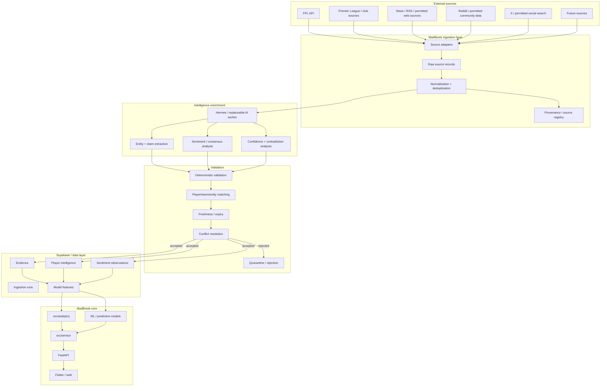

<!-- ───────────────────────────────────────────────────────────────────────────────────────────────
     PARKED — filed 2026-10-09, not adopted. See ADR-345 for the assessment and the trigger.

     ⚠️ This document was written by the owner's product-owner seat (ChatGPT) on 2026-10-05 and is
     preserved BELOW UNCHANGED. It is a proposal under review, not a description of MadBoots and not
     a plan of record. Nothing in it has been built.

     ⭐ Why it is kept rather than deleted: its principles are sound and several are already how
     MadBoots works. When the question returns — and it will — the next version should start from
     this rather than from scratch. ADR-345 records what it got right, what it did not know, and the
     one measurement that would un-park it.

     🔴 Read ADR-345 first. In particular: the accompanying Hermes sample did not demonstrate this
     architecture, and §6's sentiment layer was already measured and declined in August (spike 206).
     ─────────────────────────────────────────────────────────────────────────────────────────────── -->

# MadBoots — External Intelligence & Sentiment Architecture
## Proposed architecture decision / roadmap addition
**Status:** Proposal for review with Claude Code  
**Date:** 2026-10-05  
**Scope:** FPL external intelligence, evidence extraction, sentiment and model-enrichment pipeline

---

## 1. Executive decision

MadBoots should add an **External Intelligence Layer** that continuously collects permitted information from external sources, converts unstructured material into structured evidence, calculates sentiment/consensus signals, validates the output, and makes the resulting features available to the existing MadBoots analytics and ML layers.

**Hermes Agent should be treated as an orchestration/enrichment worker, not as a core MadBoots dependency.**

The architecture must remain capable of running without Hermes. Source acquisition, schemas, validation, persistence and model features belong to MadBoots. Hermes is one replaceable implementation of the AI enrichment/orchestration step.

The key principle is:

> **Hermes supplies evidence; MadBoots analytics decide.**

No LLM-generated statement should directly alter a production player score, availability state, transfer recommendation or other decision without deterministic validation and provenance.

---

# 2. Why this belongs in MadBoots

The existing architecture already has:

- FPL data ingestion
- ClubElo
- Reddit/RSS clients
- GitHub Actions data workflows
- Supabase/Postgres
- a reusable `src/analytics` core
- ML/player-history work
- FastAPI serving the product
- Flutter as the intended product surface

The current architecture review shows Reddit/RSS feeding the analytics path directly. That is acceptable for simple structured inputs but becomes unsafe as external intelligence expands.

The new layer should therefore formalise:

**source → raw evidence → extraction → interpretation → validation → feature → analytics**

rather than:

**source → AI → analytics**

---

# 3. Target architecture



---

# 4. Architectural boundaries

## 4.1 Source acquisition

Source acquisition should be deterministic wherever possible.

Preferred order:

1. Official API
2. RSS/feed
3. Permitted structured endpoint
4. Permitted web extraction
5. Browser automation for genuinely dynamic sources
6. Scraping only where permitted and necessary

Hermes has web search/extraction, browser automation, scheduled tasks and MCP integrations, so it can perform the acquisition where appropriate. However, MadBoots should retain source-specific adapters and schemas so Hermes can be replaced later.

## 4.2 Evidence

Every external claim should have provenance.

Minimum fields:

```text
source_id
source_type
source_url
retrieved_at
published_at
source_author
source_reliability
content_hash
player_id / team_id
claim_type
claim_text
claim_value
confidence
expires_at
run_id
```

Do not make the original article/body the canonical MadBoots dataset.

Where licensing permits, retain the required source material; otherwise retain only the minimum information needed for provenance, auditability and model features.

## 4.3 AI enrichment

AI may:

- identify players and teams
- classify claim type
- extract structured facts
- interpret manager/club language
- classify uncertainty
- identify reasons for sentiment
- calculate semantic sentiment
- identify emerging themes
- identify contradictions between sources
- summarise evidence

AI must NOT be the sole authority for:

- player identity
- dates
- numerical values
- whether a player is officially injured
- final player score
- final transfer recommendation

Those require deterministic validation and/or authoritative source confirmation.

---

# 5. Intelligence taxonomy

The first schema should support these categories.

### Availability
- fit
- injured
- doubtful
- suspended
- returning
- minutes managed
- training status
- expected return date

### Selection
- expected starter
- expected bench
- rotation risk
- nailedness signal
- tactical role
- position/role change

### Performance context
- form narrative
- underlying-stat narrative
- tactical change
- manager confidence
- role change

### Fixture/team context
- team strength narrative
- fixture perception
- tactical matchup
- manager strategy

### Market/FPL context
- transfer interest
- captaincy consensus
- sell/buy consensus
- price-change expectation
- ownership narrative

### External sentiment
- positive
- neutral
- negative
- uncertainty
- hype
- fear
- frustration
- confidence

---

# 6. Sentiment model

Do NOT store a single generic "AI sentiment" number.

Store at least four distinct signals.

## 6.1 Crowd sentiment

What the wider FPL community is saying.

Example:

```text
player_id: 123
window: 24h
mention_count: 1842
positive: 0.61
neutral: 0.18
negative: 0.21
sentiment_score: +0.40
```

## 6.2 Credible-consensus signal

Weighted sentiment from identified analysts/journalists/club sources.

This should have a source-quality weighting very different from anonymous community posts.

## 6.3 Information signal

What has actually changed in the evidence.

Example:

```text
training_return = +1
manager_confirmation = +1
injury_report = -1
rotation_warning = -0.5
```

This is deliberately NOT sentiment.

## 6.4 Sentiment divergence

The difference between crowd sentiment and the quantitative model.

Example:

```text
quant_score = 84
expert_consensus = 79
crowd_sentiment = 43
```

Potentially useful feature:

```text
sentiment_divergence = crowd_sentiment - quantitative_expectation
```

This should be tested, not assumed to be predictive.

---

# 7. Time-series design

Sentiment and intelligence must be timestamped.

Do not overwrite:

```text
player.sentiment = 0.63
```

Instead store observations:

```text
player_id
observed_at
window_start
window_end
source_set
mention_count
sentiment_score
confidence
topic
```

This enables historical backtesting.

The critical question is:

> **Did sentiment known before the FPL deadline improve prediction of future points, minutes or transfer outcomes?**

That can only be answered if historical observations are preserved.

---

# 8. Source reliability

Create a source registry.

Example:

| Source class | Default trust | Use |
|---|---:|---|
| FPL/official club/PL | Very high | factual confirmation |
| Established club journalist | High | breaking information |
| Specialist FPL analyst | Medium-high | interpretation |
| Major sports/news outlet | Medium-high | reporting/context |
| Reddit | Low individually / useful collectively | crowd sentiment |
| X anonymous account | Very low | discovery only |
| Aggregator | Low-medium | discovery/cross-check |

These are starting defaults, not permanent truths.

The system should learn source reliability from historical accuracy where measurable.

---

# 9. Contradiction handling

Conflicting claims are expected.

Example:

```text
Source A: player trained normally
Source B: player missed training
Source C: manager says player is doubtful
```

Do not ask the LLM to simply "pick one".

Create competing evidence records.

Then calculate:

```text
authority
recency
source_reliability
specificity
independence
```

The final player state should be deterministic or explicitly marked uncertain.

Example:

```text
availability = "uncertain"
confidence = 0.67
reason = "conflicting reports"
```

This is preferable to false precision.

---

# 10. Hermes' role

Hermes should initially perform:

1. scheduled collection
2. web/search extraction
3. browser interaction where required
4. structured claim extraction
5. sentiment classification
6. topic classification
7. contradiction discovery
8. evidence summarisation
9. submission to a MadBoots ingestion endpoint

Hermes should NOT initially:

- write directly to production tables
- modify the core analytics code
- modify player ratings
- change model coefficients
- change source trust weights
- deploy MadBoots

Use a staging boundary.

---

# 11. Proposed API boundary

Introduce a private ingestion endpoint, conceptually:

```text
POST /internal/intelligence/v1/evidence
POST /internal/intelligence/v1/sentiment
POST /internal/intelligence/v1/run
```

The endpoint should authenticate the worker and validate the schema.

Hermes submits structured records.

MadBoots performs:

```text
authentication
→ schema validation
→ player/team resolution
→ provenance validation
→ freshness checks
→ duplicate detection
→ confidence thresholds
→ staging
```

Only a separate promotion process makes data available to production analytics.

---

# 12. Suggested database objects

Initial conceptual schema:

```text
intelligence_sources
intelligence_runs
intelligence_raw
intelligence_evidence
intelligence_player_state
intelligence_sentiment
intelligence_topics
intelligence_conflicts
intelligence_model_features
```

### `intelligence_sources`

Stores:

```text
source_id
name
type
base_url
reliability_score
enabled
terms_reviewed
last_success_at
```

### `intelligence_runs`

Stores:

```text
run_id
started_at
finished_at
source_count
items_found
items_processed
items_accepted
items_rejected
errors
model_used
```

### `intelligence_evidence`

Stores the atomic claim.

### `intelligence_sentiment`

Stores the time-series sentiment observation.

### `intelligence_model_features`

Stores only validated features consumed by analytics/ML.

This last separation is important: the model should not need to understand the entire web/research dataset.

---

# 13. Model-feature examples

Possible features:

```text
injury_confidence
availability_confidence
minutes_risk
rotation_risk
role_change_score
manager_confidence
news_sentiment_24h
news_sentiment_7d
crowd_sentiment_24h
crowd_sentiment_7d
sentiment_change_24h
sentiment_change_7d
sentiment_divergence
expert_consensus
information_velocity
credible_source_count
contradiction_count
```

All should be treated as candidate features until backtesting proves value.

---

# 14. Model governance

The existing quantitative model remains authoritative.

The intelligence layer is initially:

**research → features → experiment**

not:

**research → automatic recommendation**

Every feature should be evaluated using historical data.

For each candidate feature measure:

- correlation with future points
- predictive lift
- calibration
- effect on transfer recommendations
- effect on captaincy decisions
- false-positive rate
- stability between seasons
- usefulness after controlling for existing features

A feature that does not improve out-of-sample performance should be removed.

---

# 15. Timing and freshness

Different information needs different schedules.

### FPL core data
Existing pipeline cadence.

### Official/team news
Every 1–3 hours during active periods.

### Social sentiment
Every 1–3 hours near deadlines; less frequently otherwise.

### News/RSS
Every 1–3 hours.

### Deep intelligence pass
Once per day.

### Pre-deadline intelligence pass
A dedicated run shortly before the FPL deadline.

The exact schedules should be configurable rather than hard-coded.

---

# 16. Cost control

Do not send every piece of content to an expensive model.

Use a funnel:

```text
cheap/deterministic filtering
        ↓
deduplication
        ↓
relevance classifier
        ↓
small/cheap LLM
        ↓
strong LLM only for ambiguous/high-value items
        ↓
deterministic validation
```

For example:

10,000 raw mentions
→ 2,000 relevant
→ 500 novel
→ 150 needing interpretation
→ 20 requiring expensive reasoning

This is likely to be much cheaper than asking a strong model to process everything.

---

# 17. Security

Hermes must not receive unrestricted production credentials.

Initial deployment:

```text
Hermes
  ↓
isolated worker
  ↓
private authenticated ingestion API
  ↓
Supabase staging
```

The worker should have:

- no Supabase service-role key
- no unrestricted production shell access
- no ability to deploy
- no ability to modify analytics code
- separate API credential
- rate-limited ingestion
- auditable run IDs

Prompt injection from external web content must be treated as hostile input.

The agent must never follow instructions embedded in scraped articles, Reddit posts, webpages or social content.

---

# 18. Legal/data-rights principle

"Publicly visible" does not automatically mean "safe to commercialise".

For each source record:

```text
source_terms_status
commercial_use_status
collection_method
retention_policy
```

Prefer APIs and feeds where available.

Do not build the business-critical pipeline around a source whose commercial-use terms are unclear.

For social sources in particular, store the minimum necessary data and retain provenance rather than indiscriminately copying entire feeds.

---

# 19. Roadmap placement

This should NOT jump ahead of the foundational pipeline work.

### Stage 0 — Current
Existing FPL/ClubElo/Reddit ingestion and analytics.

### Stage 1 — Data pipeline foundation
**Priority: already planned**

- autonomous FPL data pipeline
- deterministic source adapters
- reliable scheduling
- run logging
- freshness monitoring
- Supabase hardening/RLS
- reproducible ingestion

### Stage 2 — Intelligence ingestion spike
**New roadmap item**

Build a small end-to-end vertical slice:

```text
3–5 sources
→ collect
→ extract
→ sentiment
→ validate
→ Supabase staging
```

No model impact.

### Stage 3 — Historical dataset
Backfill enough historical evidence/sentiment to permit proper testing.

This is critical. Do not tune the model on only live observations.

### Stage 4 — Feature evaluation
Add intelligence features to the existing analytics/ML experiments.

Run controlled backtests:

```text
baseline model
vs
baseline + intelligence
vs
baseline + sentiment
vs
baseline + both
```

### Stage 5 — Production intelligence
Only after measurable lift:

- production schedules
- monitoring
- source health
- confidence thresholds
- model-feature publication
- pre-deadline intelligence refresh

### Stage 6 — Product exposure
Only after the underlying signals are proven:

- player intelligence
- injury context
- sentiment indicators
- "why this rating changed"
- optional user-facing evidence

Do NOT expose "AI sentiment" merely because it exists.

---

# 20. First MVP

The first implementation should be deliberately tiny.

### Sources

Start with:

1. FPL
2. one official/club source
3. one trusted FPL/news source
4. Reddit/community source where permitted
5. one additional news source

### Players

Start with the top 50–100 FPL-relevant players.

### Signals

Only:

```text
availability
rotation_risk
role_change
crowd_sentiment
credible_consensus
information_change
confidence
```

### Output

One Supabase staging dataset.

### Success criterion

Not "Hermes works."

The success criterion is:

> **Can MadBoots produce a clean, timestamped, provenance-backed intelligence dataset that can later be backtested against FPL outcomes?**

---

# 21. Claude Code implementation brief

Give Claude Code this task before writing production code:

> Review the existing MadBoots architecture and the proposed External Intelligence & Sentiment Architecture.
>
> Do not implement it yet.
>
> First:
>
> 1. Identify all existing FPL, ClubElo, Reddit/RSS and scheduled-ingestion code.
> 2. Identify where external data currently bypasses a common ingestion layer.
> 3. Identify the existing Supabase schema relevant to player history, analytics and scheduled data.
> 4. Identify the existing GitHub Actions data workflows and their reliability.
> 5. Identify the cleanest package boundary for source adapters, evidence, intelligence and model features.
> 6. Propose exact table names, columns and indexes.
> 7. Propose the private API contract between an external intelligence worker such as Hermes and MadBoots.
> 8. Identify any existing code that can be reused rather than creating duplicate clients.
> 9. Produce a migration plan that does not change current player ratings or production recommendations.
>
> Do not add an LLM dependency to `src/analytics`.
>
> Do not make Hermes a required runtime dependency.
>
> The core architecture must remain capable of operating if Hermes is removed.
>
> Return the proposal as an ADR plus an implementation sequence, and wait for approval before modifying code.

---

# 22. Proposed architectural principle

Add this to the architecture documentation:

> **External intelligence is evidence, not authority.**
>
> MadBoots may use AI to collect, interpret, classify and summarise external information, but production analytics consume only validated, timestamped, provenance-backed features. The analytics layer remains deterministic/model-driven and must not depend on a particular AI provider or agent framework.

---

# 23. Decision summary

### Adopt

- External Intelligence Layer
- source adapters
- evidence/provenance model
- sentiment time series
- crowd vs credible consensus separation
- contradiction handling
- model-feature boundary
- historical backtesting
- Hermes as an optional orchestration/enrichment worker

### Do not adopt yet

- automatic AI-generated player recommendations
- direct Hermes → production database writes
- LLM inside `src/analytics`
- dependence on a single social platform
- uncontrolled web scraping
- sentiment as a standalone player score

### The strategic objective

Build a **continuously refreshed FPL intelligence dataset** that can be tested against the existing MadBoots quantitative model.

The question is not:

> "Can AI find useful FPL information?"

The question is:

> **"Does validated external intelligence improve MadBoots' predictions enough to make the product better?"**

That is the experiment worth running.
